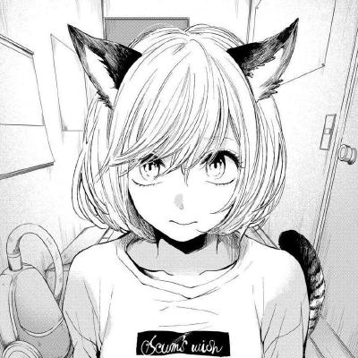

<h1 align=center>
    
    
<b>Alice <i>"Hellcutie"</i></b>

</h1>

## **Hello there.**
I'm Alice. C/Modern C++ programmer.

I also know and use/used other languages:
- Python - Level: Advanced
- Java - Level: Newbie
- Lua - Level: Newbie
- JavaScript - Level: Normal
- CSS - Level: Advanced
- HTML - Level: Normal

Currently working with **C++20**.  
Trying to learn **OpenGL**, **SDL2**, and **_other multimedia_** libraries XD

## **Licensing**
I'm a radical Open Source enthusiast, all of my code and software comes with GPL3.0/AGPL3.0 open source licenses. Feel free to use code and software in your projects, except proprietary software.
